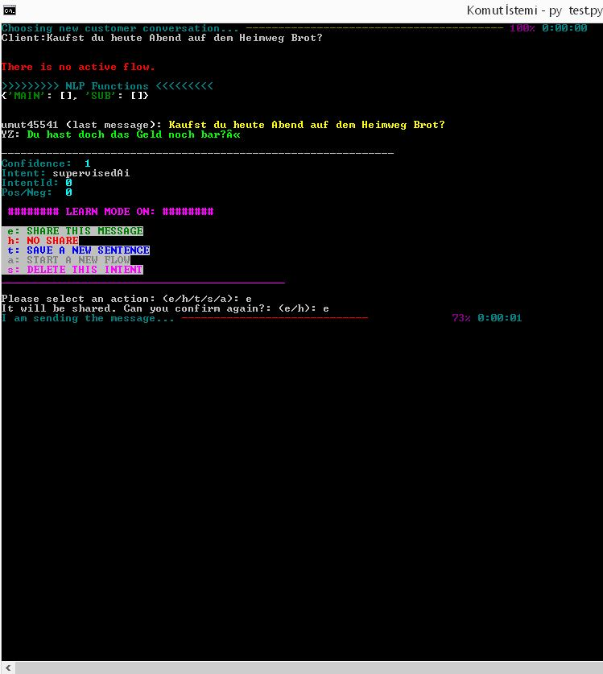
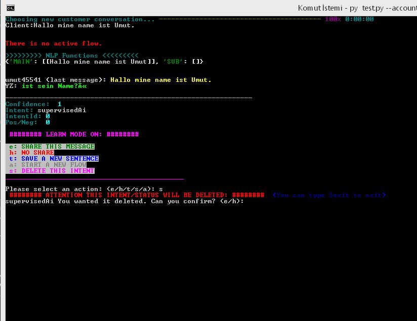
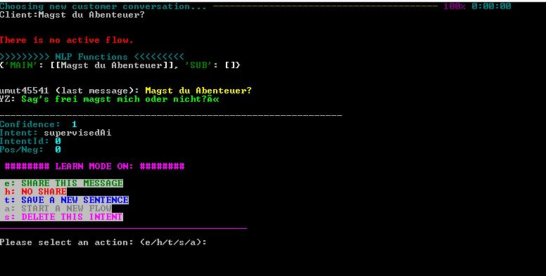
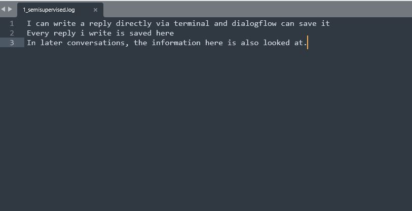
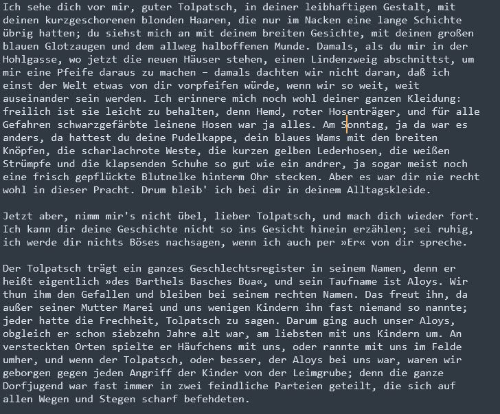
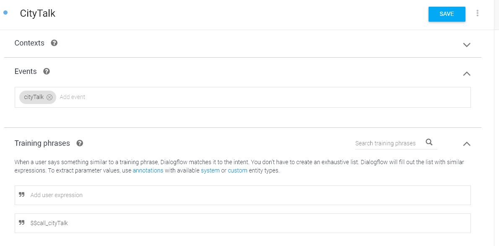
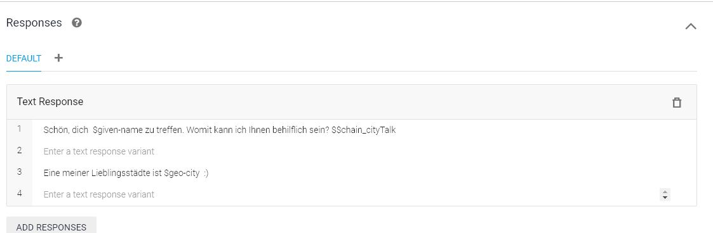
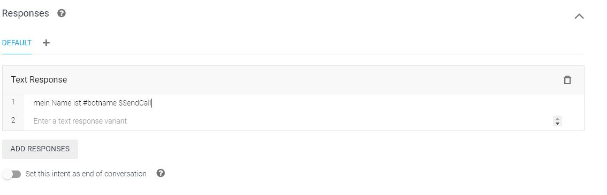

### I created a much more advanced chatbot using Google Dialogflow.

Dialogflow alone is insufficient in many respects. For this reason, I first made Dialogflow work in a terminal interface.



All of Dialogflow's save, update, delete etc. We can do all the transactions through the terminal.



The program has NLP support, especially in German.

Where Dialogflow falls short, a Semi-Supervised learning methodology comes into play.




I use Spacy and BERT tokenized for NLP processes.

Each answer given via the terminal also provides feedback, making a system that is constantly learning possible.



If a logical result is not found in the answers previously taught to the AI, a supervised mechanism comes into play again.

For the supervised learning and responsiveness system, I used a 300,000-line German fiction book as an example.



The system is made for German, but you can start using the system quickly by changing the setting.py file and other simple settings.

Since the Google Dialogflow and Flowup mechanism is also very lacking, it is possible to define different flows to a user via the terminal. For this, commands like 

    $$call_SampleFlow




    $$chain_AnotherFlow




    $$endFlow




to end a conversation can be simply added to dialogflow answers.

*I developed this code with Dialogflow's BetaV2 api. There may be functional changes over time. It may be necessary to update the libraries.*


### Setup and Settings

> update settings.py (Do not forget to add your Google Dialogflow project certificate Json file.)

```python
pip install -r requirements.txt
python -m spacy download de_core_news_md
```

> I used md but you can use sm or lg. Small, Medium, Large


To run:
```python
py test.py --account 1 --username testuser
``` 

> account is representing the bot ID. Every bot has different parameters. (/profiles directory)
> username is representing your clients. (ie. customer who wants to talk with customer care)

> You can set account and username via terminal. Code has single loop and in every loop there will be an input. Inputs are likely test interaction. 
> Instead of loops, you can bind the system to your own APIs as you wish. (Selenium IDE, Web Page or your Endpoints.)


### Directories and the Files (Explanation)

- **botexports**  //this is where you can export your Google dialogflow bot and store. [Archive, not functional]
- **certificate** //you should export your bot's porject json certificate and store here. [Action required!]
- **driver** //chrome driver for further selenium integration. You can also add mozilla [Archive, not functional]
- **flows** //For a user, you can activate a certain stream. Json files containing stream information are located in this folder. [Archive, not functional]
- **intents** //The intent information processed by the system is kept here. It works asynchronously. Queue operations only. [Archive, not functional]
- **locations** //When you want to talk to a user in the future, if you want to keep information about the city they live in.
- **nlp** 
  - **1_semisupervised.log** //The first number 1 is the bot's ID number. Every reply written via terminal is both sent to dialogflow and stored there. Then the answers are also searched in this directory.
  - **supervised.log** //If it can't find an answer from dialogflow, it tries to find an answer using BERT in this file. I recorded a fiction novel as an example. You can change it.
- **params** //Under this folder, information that can be obtained from spoken users is stored. Thus, even if time passes, the user's information can be remembered later.
- **profiles** //Under this folder, you can define different ids and properties to your bots by updating the json files.
- **sounds** //Under this folder, you can change the system sounds.
- **specials** //Under this folder, you can define hashtags such as #botname, #botage that you can put in Dialogflow answers in the codes section. You can also save content corresponding to these hashtags in the Profiles folder.
- **df.py** //All Google Dialogflow BetaV2 functions
- **dffunc.py** //Bot reply and internal process functions. (save parameters, translatation, sentiments etc.)
- **documentRetrievalModel.py** //German NLT corspur and nltk.tokenize
-  **helper.py** //removing emogies etc. helping functions
-  **menu.py** //terminal menu functions
-  **nlpclass.py** //spacy.tokens
-  **nlpgerman.py** //Spacy German specific functions. (Spliting master sentences and the sub sentences than considering the best confidence rate from Google Dialogflow)
-  **ontology.py** //Setting flowups and some human like behaviors. ie. a function name called "wrongWriting" for humanoid spelling (this can be set via settings.py)
-  **persona.py** // this is where supervise mechanism works.
-  **processedQuestion.py** // nltk question processes
-  **settings.py** //main setting file. You can change almost everything from this file.
-  **sounds.py** //sound functions
-  **test.py** //main programme
-  **tl.py** //translation functions via Google Translate
-  **wt.py** // weather function + city interaction

I will continue to improve as I get the opportunity. I would be happy if anyone would like to contribute. 

If you encounter any errors or want information, you can contact me.

Thank you <br>
**denizumutdereli@gmail.com**<br>
Umut


